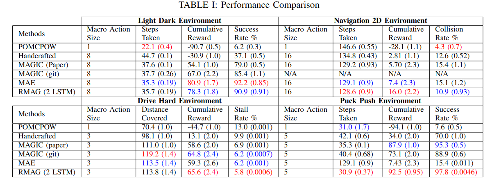

# Recurrent Macro Actions Generator for POMDP Planning

By Yuanch Liang and Hanna Kurniawati

School of Computing, The Australian National University, Canberra, Australia

### Overview
We propose to use a encoder and a recurrent generator conditoned on the encoded environment context to produce macro actions for a planner. 

The encoder and the recurrent generator is trained end to end with the following architecture,

When testing on four different environments, we obtain below promising results,

Please refer to the paper for more detailed methodlogy and experiments discussions.

The source code is built on top of [MAGIC](https://github.com/AdaCompNUS/magic). The simulators are written in C++ (`cpp` folder) and training schemes are written in Python (`python` folder).

**If you are looking for the specifics of each task (e.g. parameters, constants, dynamics)**, jump ahead to:

- [`cpp/include/core/simulations/`](cpp/include/core/simulations/) for parameters and constants
- [`cpp/src/core/simulations/`](cpp/src/core/simulations/) for task dynamics and observation models

# Installations

### C++

You will need to compile the C++ binaries to run the Python experiments.

##### Prerequisites
For compiling the binaries, you will need to have:
- [Boost library](https://www.boost.org/)
- [OpenCV library](https://opencv.org/)
- At least GCC-7.0
- At least CMake 3.14

#### Compiling
- `mkdir cpp/build; cd cpp/build;`
- `cmake ..`
- `make`

Ensure that the Boost and OpenCV headers and libraries are accessible during compilation (`cmake` and `make`). If installed in a custom location, you may find the CMake flag `cmake .. -DCMAKE_PREFIX_PATH=<custom location>` useful.

### Python

#### Prerequisites
To run the (virtual) experiments, you will need to have:
-  C++ binaries compiled (see previous C++ section)
- At least Python 3.6.8
- A CUDA enabled GPU
- Dependent PIP packages: `pip3 install np torch pyzmq gym tensorboard`
- Additional dependent packages: [`power_spherical`](https://github.com/nicola-decao/power_spherical)

# Running Experiments
The `python` folder contains all scripts to run experiments. It is split into multiple subfolders each serving a different purpose.
Note in the code we name MAGIC as the vanilla model, MAE as the encoder and RMAG as the RNN model.

- ~~`alphabot/`: Scripts which are run on a real world robot to listen to control commands over WiFi~~ (You won't need this for the virtual experiments).
- `mdespot_handcrafted/`: Scripts to run (Macro-)DESPOT using handcrafted actions/macro-actions on our tasks.
    - `evaluate.py`: to visualize the approach.
        - e.g. `python3 evaluate.py --task=LightDark --macro-length=4`
    - `benchmark.py`: to test performance.
        - e.g. `python3 benchmark.py --task=LightDark --macro-length=4 --num-env=16`
- `mdespot_magic/`: Scripts to run MAGIC, MAE and RMAG. Change the argument `gen-model-name` accordingly (Vanilla for MAGIC, Encoder for MAE, RNN for RMAG)
    - `evaluate.py` to visualize the approach using a trained Generator.
      - e.g. `python3 evaluate.py --task=LightDark --macro-length=8 --model-path=../models/learned_LightDark_8 --model-index=500000 --gen-model-name=Vanilla`
    - `benchmark.py` to test performance using a trained Generator.
      - e.g. `python3 benchmark.py --task=LightDark --macro-length=8 --num-env=16 --models-folder=../models/learned_LightDark_8 --model-index=500000 --gen-model-name=Vanilla`
    - `train.py` to train both Generator + Critic.
      - e.g. `python3 train.py --task=LightDark --macro-length=8 --num-env=16 --num-iterations=500000 --output-dir=../models/learned_LightDark_8 --gen-model-name=Vanilla`
- `models/`: Contains the neural networks used. Also contains the trained models for each task.
- `pomcpow/`: Scripts to run POMCPOW for our tasks.
    - `valuate.py`: to visualize the approach.
        - e.g. `python3 --task=LightDark`
    - `benchmark.py`: to test performance.
        - e.g. `python3 --task=LightDark --num-env=16 `
    - `tune_params.py`: to tune the POMCPOW hyperparameters via grid search.
        - e.g. `python3 --task=LightDark --trials=30 --num-env=16`
